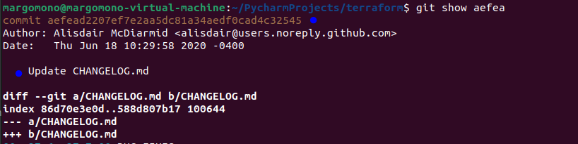
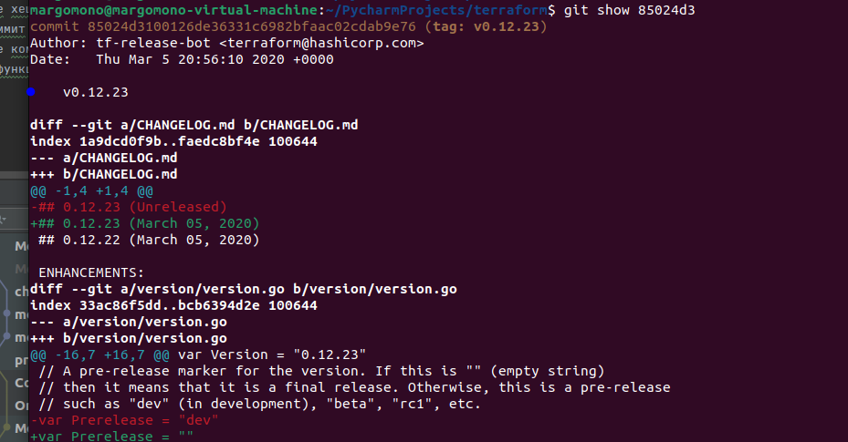
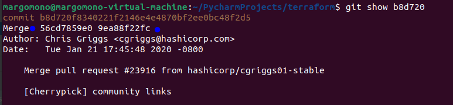
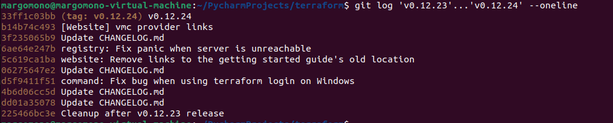
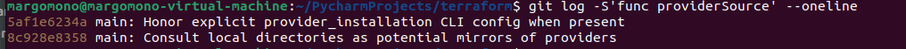
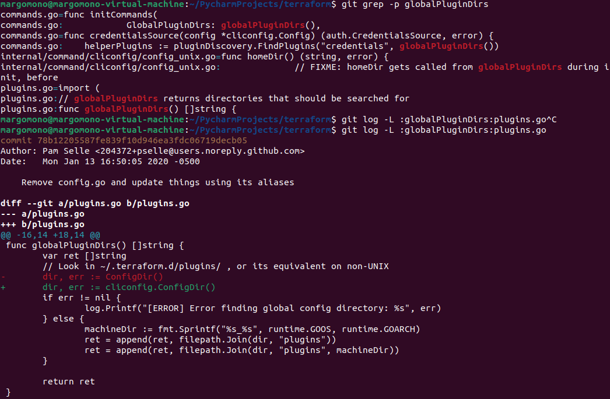
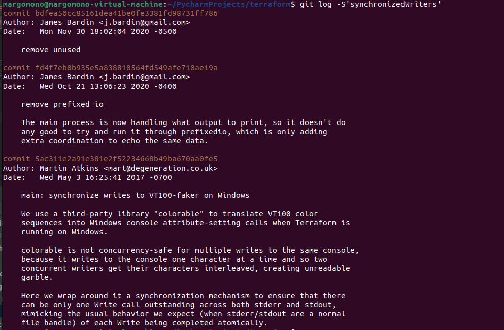

1. Найдите полный хеш и комментарий коммита, хеш которого начинается на aefea.

- Хэш - aefead2207ef7e2aa5dc81a34aedf0cad4c32545, 
- комментарий "Update CHANGELOG.md"

2. Какому тегу соответствует коммит 85024d3?

Тег v0.12.23

3. Сколько родителей у коммита b8d720? Напишите их хеши.

2 родителя:
- 56cd7859e0, 
- 9ea88f22fc

4. Перечислите хеши и комментарии всех коммитов которые были сделаны между тегами v0.12.23 и v0.12.24. 

- 33ff1c03bb (tag: v0.12.24) v0.12.24
- b14b74c493 [Website] vmc provider links
- 3f235065b9 Update CHANGELOG.md
- 6ae64e247b registry: Fix panic when server is unreachable
- 5c619ca1ba website: Remove links to the getting started guide's old location
- 06275647e2 Update CHANGELOG.md
- d5f9411f51 command: Fix bug when using terraform login on Windows
- 4b6d06cc5d Update CHANGELOG.md
- dd01a35078 Update CHANGELOG.md
- 225466bc3e Cleanup after v0.12.23 release

5. Найдите коммит в котором была создана функция func providerSource, ее определение в коде выглядит так func providerSource(...) (вместо троеточия перечислены аргументы).

8c928e835 main: Consult local directories as potential mirrors of providers

6. Найдите все коммиты в которых была изменена функция globalPluginDirs.

- 78b12205587fe839f10d946ea3fdc06719decb05
- 52dbf94834cb970b510f2fba853a5b49ad9b1a46

7. Кто автор функции _synchronizedWriters_?

Author: Martin Atkins <mart@degeneration.co.uk>

