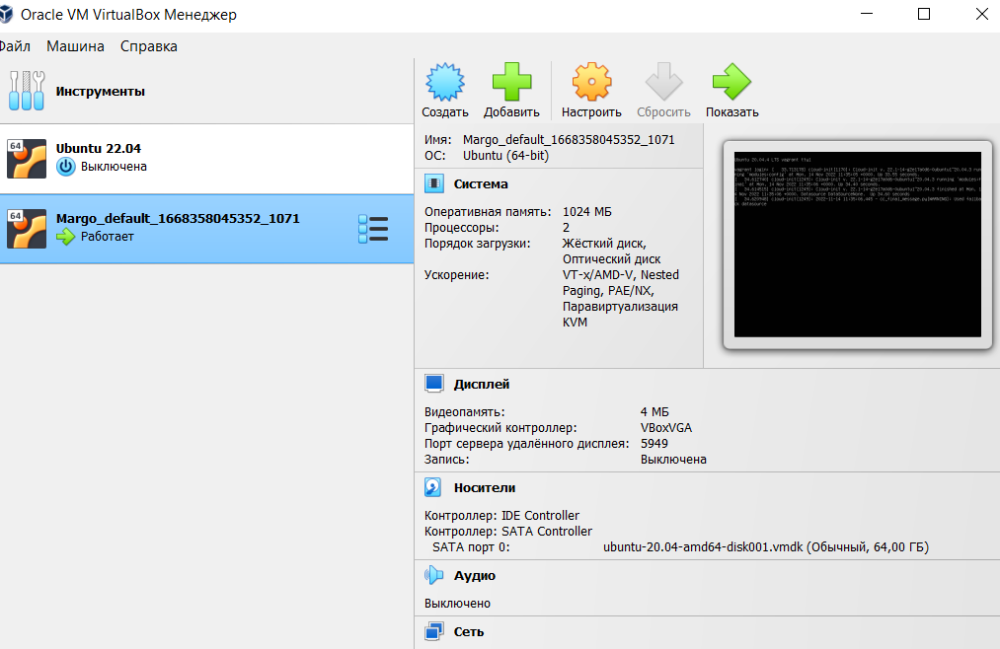
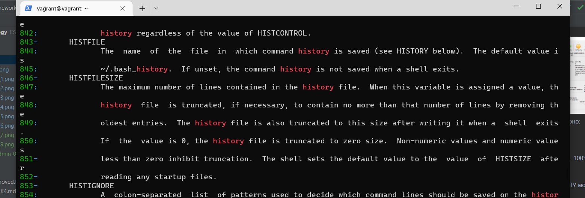
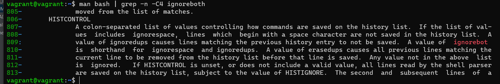
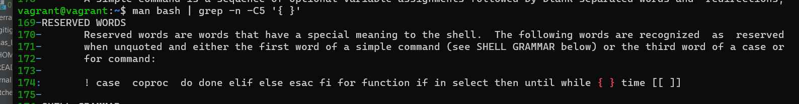
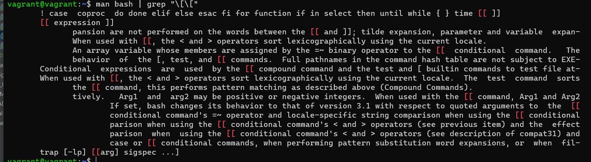
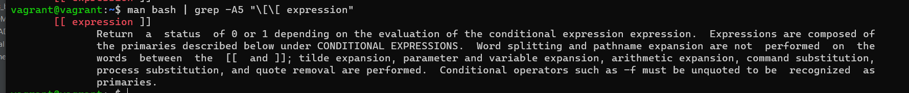
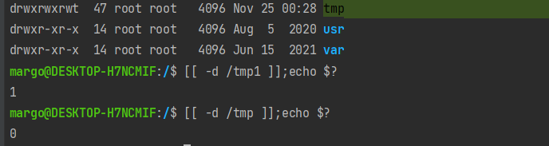
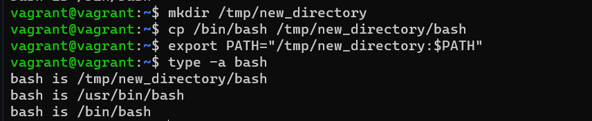

**1. С помощью базового файла конфигурации запустите Ubuntu 20.04 в VirtualBox посредством Vagrant**

Сделано



**2. Ознакомьтесь с графическим интерфейсом VirtualBox, посмотрите как выглядит виртуальная машина, которую создал для вас Vagrant, какие аппаратные ресурсы ей выделены. Какие ресурсы выделены по-умолчанию?**

По умолчанию выделено:
- 1024 МБ памяти,
- 2 ЦП,
- предел загрузки ЦПУ - 100%,
- видеопамять 4Mб

**3. Ознакомьтесь с возможностями конфигурации VirtualBox через Vagrantfile: документация. Как добавить оперативной памяти или ресурсов процессора виртуальной машине?**

Добавить памяти и ЦПУ можно с помощью настроек
```
config.vm.provider "virtualbox" do |v|
   v.memory = 1024
   v.cpus = 2
   end
```   

**4. Команда vagrant ssh из директории, в которой содержится Vagrantfile, позволит вам оказаться внутри виртуальной машины без каких-либо дополнительных настроек. Попрактикуйтесь в выполнении обсуждаемых команд в терминале Ubuntu.**

Подключилась


**5.1. Какой переменной можно задать длину журнала history, и на какой строчке manual это описывается?**

Переменная HISTFILESIZE, строки 846-847!



**5.1. Какой переменной можно задать длину журнала history, и на какой строчке manual это описывается?**

ignoreboth — не записывать команду, которая начинается с пробела, либо команду, 
которая дублирует предыдущую, строки 806-813



**6. В каких сценариях использования применимы скобки {} и на какой строчке man bash это описано?**

{} - зарезервированные слова, можно использовать только для вызова списка в командах, строки 169-174



**7. С учётом ответа на предыдущий вопрос, как создать однократным вызовом touch 100000 файлов? Получится ли аналогичным образом создать 300000? Если нет, то почему?**

```
touch {1..100000}
```

Создать больше 2097152 не получится
```
getconf ARG_MAX
2097152
```

**8.1. В man bash поищите по /\[\[.**



**8.1. Что делает конструкция [[ -d /tmp ]]?**

Проверяет условие у -d /tmp и возвращает 0 или 1, в случае наличия или отсутствия каталога /tmp



В случае если каталог есть - вернется 0, если нет - 1



**9. Основываясь на знаниях о просмотре текущих (например, PATH) и установке новых переменных; командах, которые мы рассматривали, добейтесь в выводе type -a bash в виртуальной машине наличия первым пунктом в списке**



**10. Чем отличается планирование команд с помощью batch и at?**

```
at time запускает команду в определенное время
batch или его псевдоним at -b планирует задания и выполняет команды в пакетной очереди, если позволяет уровень загрузки системы. Значение нагрузки можно указать при вызове демона atd. Если средняя загрузка системы выше указанной, задания будут ждать в очереди.
```
