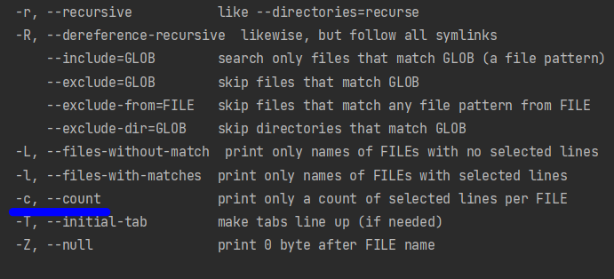
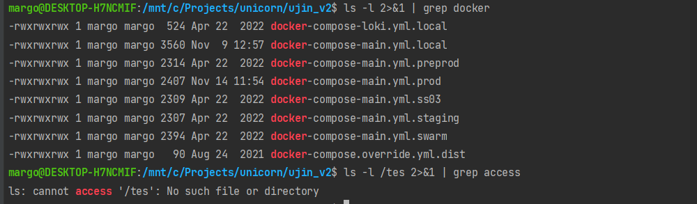
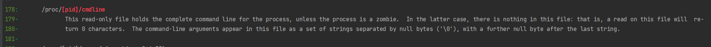
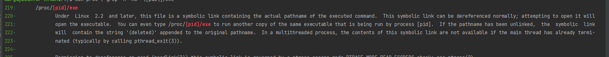
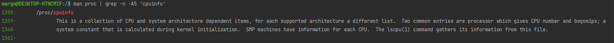
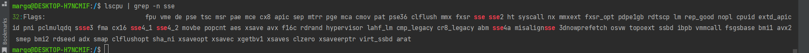

**1. Какого типа команда cd? Попробуйте объяснить, почему она именно такого типа: опишите ход своих мыслей, если считаете, что она могла бы быть другого типа.**

Это внутренняя команда (внутренняя команда - это команда, которая встроена непосредственно в Bash). 

Запустила:
```bash
type cd
```

Получила:
```bash
cd is a shell builtin
```

**2.Какая альтернатива без pipe команде grep <some_string> <some_file> | wc -l?**

Альтернатива:
```bash
grep <some_string> -c <some_file> 
```


**3. Какой процесс с PID 1 является родителем для всех процессов в вашей виртуальной машине Ubuntu 20.04?**

systemd

Узнала с помощью команды: ```pstree -p```

**4. Как будет выглядеть команда, которая перенаправит вывод stderr ls на другую сессию терминала?**

Сначала узнаем dev/pts для второй консоли используя ```lsof -p $$``` (потом оказалось, что можно было использовать ```tty```)

Получаем /dev/pts/9

Перенаправляем (пытаясь получить несуществующий каталог):
```bash
ls -l /de 2>/dev/pts/9
```

**5. Получится ли одновременно передать команде файл на stdin и вывести ее stdout в другой файл? Приведите работающий пример.**

Да
```bash
 cat <file1.txt>file1.txt
```

**6. Получится ли, находясь в графическом режиме, вывести данные из PTY в какой-либо из эмуляторов TTY? 
Сможете ли вы наблюдать выводимые данные?**

Да
```bash
echo 'test' > /dev/tty1
```
Да, если авторизуюсь в TTY (тут еще проблемы)

**7. Выполните команду bash 5>&1. К чему она приведет? Что будет, если вы выполните echo netology > /proc/$$/fd/5? Почему так происходит?**

bash 5>&1 - создали дексриптор с номером 5 и направили вывод из него в stdout текущего терминал
echo netology > /proc/$$/fd/5 - получим в текущем терминале netology (будет работать только там, где предварительно был создан такой дексриптор)

**8. Получится ли в качестве входного потока для pipe использовать только stderr команды, 
не потеряв при этом отображение stdout на pty?
Напоминаем: по умолчанию через pipe передается только stdout команды слева от | на stdin команды справа. 
Это можно сделать, поменяв стандартные потоки местами через промежуточный новый дескриптор, 
который вы научились создавать в предыдущем вопросе.**

```
ls -l /ts 6>&2 2>&1 1>&6 |grep access
```

- создали дескриптор с номером 5,
- отправили в дескриптор 5 stderr текущего терминала,
- stderr текущего терминала в stdout,
- stdout текущего терминала в дескриптор

P.S. Не понимаю зачем нужен промежуточный дескриптор, так тоже работает


**9. Что выведет команда cat /proc/$$/environ? Как еще можно получить аналогичный по содержанию вывод?**

Переменные окружения, аналогия - printenv

**10. Используя man, опишите что доступно по адресам /proc/<PID>/cmdline, /proc/<PID>/exe.**

/proc/<PID>/cmdline - исполняемый файла процесса


/proc/<PID>/exe - симлинк до исполняемого файла,запустив его - запустим копию процесса



**11. Узнайте, какую наиболее старшую версию набора инструкций SSE поддерживает ваш процессор с помощью /proc/cpuinfo.**

sse4_2



**12. При открытии нового окна терминала и vagrant ssh создается новая сессия и выделяется pty.
Это можно подтвердить командой tty, которая упоминалась в лекции 3.2.
Однако: vagrant@netology1:~$ ssh localhost 'tty'
not a tty
Почитайте, почему так происходит, и как изменить поведение.**

По умолчанию выделяется tty
Необходим флаг -t при вызове ssh (принудительное выделение tty).

**13. Бывает, что есть необходимость переместить запущенный процесс из одной сессии в другую.
Попробуйте сделать это, воспользовавшись reptyr. Например, так можно перенести в screen процесс, 
который вы запустили по ошибке в обычной SSH-сессии.**

Изучила доку (https://github.com/nelhage/reptyr) + тут https://www.maketecheasier.com/use-reptyr-move-processes/, сделала, правда 
по дороге словила проблему из-за отсутствия ключа -T


**14. sudo echo string > /root/new_file не даст выполнить перенаправление под обычным пользователем, 
так как перенаправлением занимается процесс shell'а, который запущен без sudo под вашим пользователем.
Для решения данной проблемы можно использовать конструкцию echo string | sudo tee /root/new_file. 
Узнайте? что делает команда tee и почему в отличие от sudo echo команда с sudo tee будет работать.**

Команда tee принимает данные из одного источника и может сохранять их на выходе в нескольких местах.
В основном используется для отображения стандартного вывода ( stdout ) программы и записи его в файл.
Tee получит вывод команды echo, повысит разрешения до sudo и запишет в файл.

