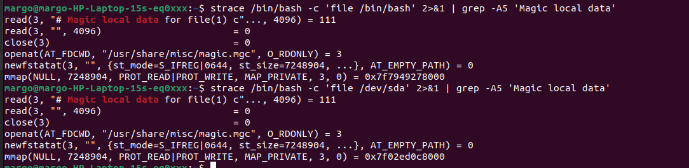
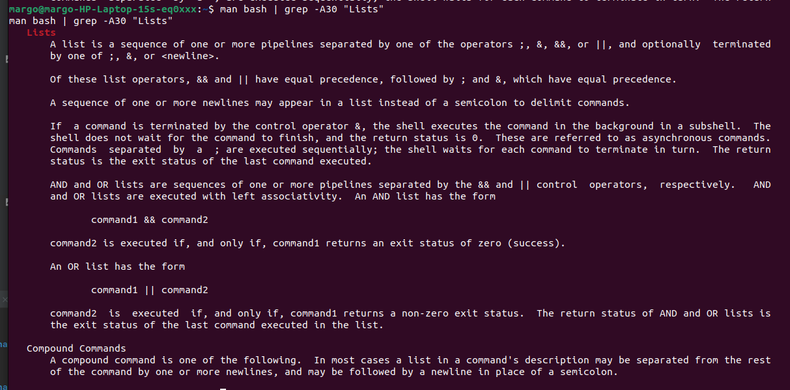
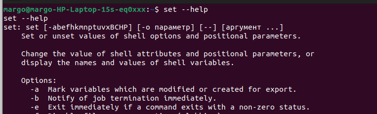
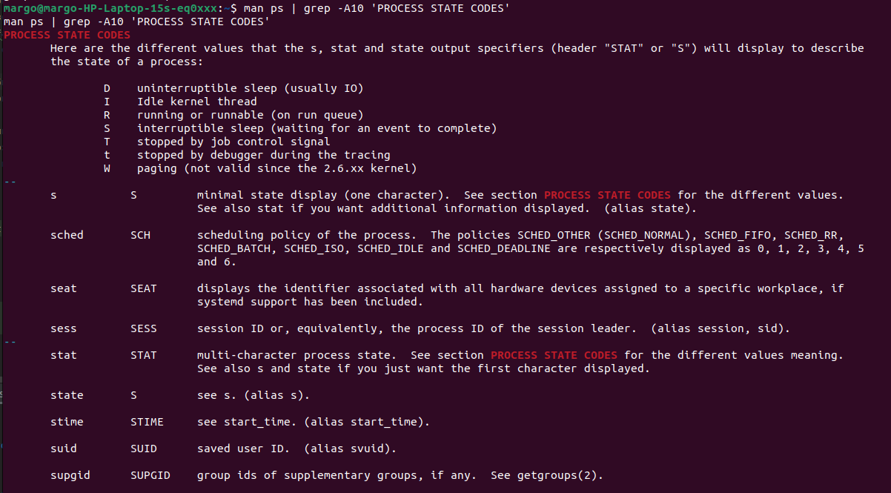
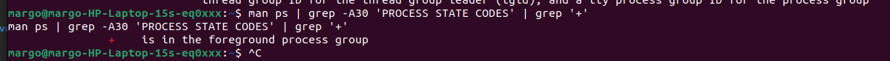

**1. Какой системный вызов делает команда cd?**

Запустила:
```bash
strace /bin/bash -c 'cd /tmp' 2>&1 | grep  '/tmp'
```

Получила:
```bash
chdir("/tmp")                           = 0
```

**2. Попробуйте использовать команду file на объекты разных типов в файловой системе. Используя strace выясните, где находится база данных file, на основании которой она делает свои догадки.**

Запустила:
```bash
strace /bin/bash -c 'file /dev/tty' 2>&1 | grep  'file'
```

Получила:
```bash
strace /bin/bash -c 'file /dev/tty' 2>&1 | grep  'file'
execve("/bin/bash", ["/bin/bash", "-c", "file /dev/tty"], 0x7ffe46d93960 /* 44 vars */) = 0
newfstatat(AT_FDCWD, "/usr/local/sbin/file", 0x7ffd1c704870, 0) = -1 ENOENT (Нет такого файла или каталога)
newfstatat(AT_FDCWD, "/usr/local/bin/file", 0x7ffd1c704870, 0) = -1 ENOENT (Нет такого файла или каталога)
newfstatat(AT_FDCWD, "/usr/sbin/file", 0x7ffd1c704870, 0) = -1 ENOENT (Нет такого файла или каталога)
newfstatat(AT_FDCWD, "/usr/bin/file", {st_mode=S_IFREG|0755, st_size=27200, ...}, 0) = 0
newfstatat(AT_FDCWD, "/usr/bin/file", {st_mode=S_IFREG|0755, st_size=27200, ...}, 0) = 0
access("/usr/bin/file", X_OK)           = 0
newfstatat(AT_FDCWD, "/usr/bin/file", {st_mode=S_IFREG|0755, st_size=27200, ...}, 0) = 0
access("/usr/bin/file", R_OK)           = 0
newfstatat(AT_FDCWD, "/usr/bin/file", {st_mode=S_IFREG|0755, st_size=27200, ...}, 0) = 0
newfstatat(AT_FDCWD, "/usr/bin/file", {st_mode=S_IFREG|0755, st_size=27200, ...}, 0) = 0
access("/usr/bin/file", X_OK)           = 0
newfstatat(AT_FDCWD, "/usr/bin/file", {st_mode=S_IFREG|0755, st_size=27200, ...}, 0) = 0
access("/usr/bin/file", R_OK)           = 0
execve("/usr/bin/file", ["file", "/dev/tty"], 0x563bb29f74c0 /* 44 vars */) = 0
read(3, "# Magic local data for file(1) c"..., 4096) = 111
```

Обратила внимание на строку "Magic local data for file".

Запустила посмотреть что идет после этой строки:
```bash
strace /bin/bash -c 'file /dev/tty' 2>&1 | grep -A5 'Magic local data'
```

Получила:
```bash
read(3, "# Magic local data for file(1) c"..., 4096) = 111
read(3, "", 4096)                       = 0
close(3)                                = 0
openat(AT_FDCWD, "/usr/share/misc/magic.mgc", O_RDONLY) = 3
newfstatat(3, "", {st_mode=S_IFREG|0644, st_size=7248904, ...}, AT_EMPTY_PATH) = 0
mmap(NULL, 7248904, PROT_READ|PROT_WRITE, MAP_PRIVATE, 3, 0) = 0x7f30b772a000
```

Похоже, что ищет в базе данных usr/share/misc/magic.mgc. Проверяем для других файлов.



Судя по скрину - повторяется поиск в usr/share/misc/magic.mgc. Делаю вывод, что это БД для команды file.


**3. Предположим, приложение пишет лог в текстовый файл. Этот файл оказался удален (deleted в lsof), 
однако возможности сигналом сказать приложению переоткрыть файлы или просто перезапустить приложение – нет. 
Так как приложение продолжает писать в удаленный файл, место на диске постепенно заканчивается. 
Основываясь на знаниях о перенаправлении потоков предложите способ обнуления открытого удаленного файла 
(чтобы освободить место на файловой системе).**

Это было на лекции. Для решения данной задачи нам нужно знать pid процесса о котором идет речь и название файла.  

Находим файловый дескриптор для процесса c помощью команды
```bash
lsof -p <pid> | grep <file_name>
```

В случае если мы не знаем названия файла можно схитрить и искать по удаленным 

```bash
lsof -p <pid> | grep deleted
```

Обнулить файл мы можем так
```bash
cat /dev/null > /proc/<pid>/fd/<file_descriptor>
```

Минус в том, что файл после обнуления продолжат писаться логи, поэтому я как минимум бы его пересоздала 
файл.

**4. Занимают ли зомби-процессы какие-то ресурсы в ОС (CPU, RAM, IO)?**

Зомби нет. По факту это отработавшие процессы, которые, отработав, вернули exit code, 
который не удалось идентифицировать родительскому процессу.

**5. В iovisor BCC есть утилита opensnoop . На какие файлы вы увидели вызовы группы open за первую секунду работы утилиты?**

```bash
sudo /usr/sbin/opensnoop-bpfcc -d 1
```

```bash
560    systemd-oomd        7   0 /proc/meminfo
560    systemd-oomd        7   0 /sys/fs/cgroup/user.slice/user-1000.slice/user@1000.service/memory.pressure
560    systemd-oomd        7   0 /sys/fs/cgroup/user.slice/user-1000.slice/user@1000.service/memory.current
560    systemd-oomd        7   0 /sys/fs/cgroup/user.slice/user-1000.slice/user@1000.service/memory.min
560    systemd-oomd        7   0 /sys/fs/cgroup/user.slice/user-1000.slice/user@1000.service/memory.low
560    systemd-oomd        7   0 /sys/fs/cgroup/user.slice/user-1000.slice/user@1000.service/memory.swap.current
560    systemd-oomd        7   0 /sys/fs/cgroup/user.slice/user-1000.slice/user@1000.service/memory.stat
560    systemd-oomd        7   0 /proc/meminfo
560    systemd-oomd        7   0 /proc/meminfo
1      systemd            23   0 /proc/560/cgroup
560    systemd-oomd        7   0 /proc/meminfo
560    systemd-oomd        7   0 /proc/meminfo
```

**6. Какой системный вызов использует uname -a? Приведите цитату из man по этому системному вызову, 
где описывается альтернативное местоположение в /proc, где можно узнать версию ядра и релиз ОС.**

Запустила
```bash
strace uname -a 2>&1 | grep uname
```

Получила
```bash
execve("/usr/bin/uname", ["uname", "-a"], 0x7ffd256ecc88 /* 44 vars */) = 0
uname({sysname="Linux", nodename="margo-HP-Laptop-15s-eq0xxx", ...}) = 0
uname({sysname="Linux", nodename="margo-HP-Laptop-15s-eq0xxx", ...}) = 0
uname({sysname="Linux", nodename="margo-HP-Laptop-15s-eq0xxx", ...}) = 0
```

Запустила
```bash
man proc | grep -A5 /proc/version
```

Получила
```bash
/proc/version
              This string identifies the kernel version that is currently running.  It includes  the  contents  of  /proc/sys/ker‐
              nel/ostype, /proc/sys/kernel/osrelease, and /proc/sys/kernel/version.  For example:

                  Linux version 1.0.9 (quinlan@phaze) #1 Sat May 14 01:51:54 EDT 1994
```


**7. Чем отличается последовательность команд через ; и через && в bash? Есть ли смысл использовать в bash &&, 
если применить set -e?**

- && - условный оператор (следующая команда выполняется только при успешном выполнении предыдущей), 
- ;  - разделитель последовательных команд (следующая команда выполнится в любом случае)



set -e - останавливает процесс, если команда завершается с ненулевым статусом.



Судя по всему set -e и && взаимозаменяемы. Они обе останавливают процесс, если команда завершается с ненулевым статусом. 

**8. Из каких опций состоит режим bash set -euxo pipefail и почему его хорошо было бы использовать в сценариях?**

- -e - скрипт завершится, если команда завершается с ненулевым статусом.
- -u - скрипт завершится, если попытаться использовать незаданную переменную
- -x - выводит команды и их аргументы по мере их выполнения.
- -o pipefail - возвращаемое значение конвейера - это статус последней команды для завершения с ненулевым статусом 
или ноль, если ни одна команда не завершилась с ненулевым статусом

Будет удобно отлаживать скрипт. Получаем завершение сценария в случае ошибок, на любом этапе выполнения сценария, кроме последней завершающей команды,
вывод логов в процессе и падение скрипта в случае отсутствия переменных.  

**9. Используя -o stat для ps, определите, какой наиболее часто встречающийся статус у процессов в системе. 
В man ps ознакомьтесь (/PROCESS STATE CODES) что значат дополнительные к основной заглавной буквы статуса процессов.
Его можно не учитывать при расчете (считать S, Ss или Ssl равнозначными)**.

Запустила
```bash
ps -o stat
```

Получила
```bash
STAT
Ss
R+
```

Самый частый процесс Ss. Процессы ожидающие завершения (спящие с прерыванием)
Так же есть процесс R+. Запущенный. + означает что он находится в группе процессов переднего плана



