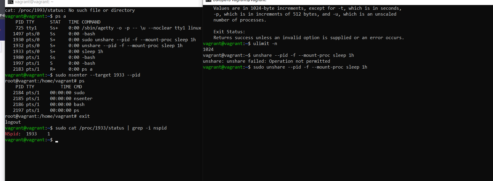

**1. На лекции мы познакомились с node_exporter. 
В демонстрации его исполняемый файл запускался в background. 
Этого достаточно для демо, но не для настоящей production-системы, 
где процессы должны находиться под внешним управлением.**

**Используя знания из лекции по systemd, создайте самостоятельно простой unit-файл для node_exporter:**
- поместите его в автозагрузку,
- предусмотрите возможность добавления опций к запускаемому процессу через внешний файл (посмотрите, например, на systemctl cat cron),
- удостоверьтесь, что с помощью systemctl процесс корректно стартует, завершается, а после перезагрузки автоматически поднимается.

Для начала установила node_exporter на виртуальую машину из домашки (https://github.com/MargoMono/devops-netology/blob/main/homework/03-sysadmin-01-terminal.md) по гайду (https://prometheus.io/docs/guides/node-exporter/)

Работает:


Создала файл автозагрузки с опциями:

```bash
[Unit]
Description=Node Exporter

[Service]
EnvironmentFile=/etc/default/node_exporter
ExecStart=/opt/node_exporter-1.3.1.linux-amd64/node_exporter $EXTRA_OPTS
Restart=on-failure

[Install]
WantedBy=default.target
```

Проверила, работает при всех необходимых сценариях:


**2. Ознакомьтесь с опциями node_exporter и выводом /metrics по-умолчанию. 
Приведите несколько опций, которые вы бы выбрали для базового мониторинга хоста по CPU, памяти, диску и сети.**

Ознакомилась

Для CPU:
```phpt
node_cpu_seconds_total{cpu="0",mode="idle"} 5178.58
node_cpu_seconds_total{cpu="0",mode="iowait"} 2.82
node_cpu_seconds_total{cpu="0",mode="softirq"} 4.33
node_cpu_seconds_total{cpu="0",mode="steal"} 0
node_cpu_seconds_total{cpu="0",mode="system"} 25.06
node_cpu_seconds_total{cpu="0",mode="user"} 9.75
node_cpu_seconds_total{cpu="1",mode="idle"} 5166.71
node_cpu_seconds_total{cpu="1",mode="iowait"} 1.84
node_cpu_seconds_total{cpu="1",mode="softirq"} 13.62
node_cpu_seconds_total{cpu="1",mode="system"} 19.78
node_cpu_seconds_total{cpu="1",mode="user"} 3.47
process_cpu_seconds_total 0.11
```


Для памяти:
```phpt
node_memory_Active_bytes 4.45657088e+08
node_memory_MemAvailable_bytes 7.0754304e+08
node_memory_MemFree_bytes 9.4117888e+07

```

Для диска:
```phpt
node_disk_io_time_seconds_total{device="dm-0"} 27.832
node_disk_io_time_seconds_total{device="sda"} 28.776
node_disk_io_time_weighted_seconds_total{device="dm-0"} 52.776
node_disk_io_time_weighted_seconds_total{device="sda"} 17.712
node_disk_read_time_seconds_total{device="dm-0"} 17.176000000000002
node_disk_read_time_seconds_total{device="sda"} 10.128
node_disk_reads_completed_total{device="dm-0"} 9855
node_disk_reads_completed_total{device="sda"} 7567
node_disk_writes_completed_total{device="dm-0"} 17762
node_disk_writes_completed_total{device="sda"} 7851

```
Для сети: 
```phpt
node_network_mtu_bytes{device="eth0"} 1500
node_network_mtu_bytes{device="lo"} 65536
node_network_protocol_type{device="eth0"} 1
node_network_protocol_type{device="lo"} 772
node_network_receive_bytes_total{device="eth0"} 1.62269712e+08
node_network_receive_bytes_total{device="lo"} 445475
node_network_receive_packets_total{device="eth0"} 112477
node_network_receive_packets_total{device="lo"} 358
node_network_speed_bytes{device="eth0"} 1.25e+08
node_network_transmit_bytes_total{device="eth0"} 1.668651e+06
node_network_transmit_bytes_total{device="lo"} 445475
node_network_transmit_packets_total{device="eth0"} 23976
node_network_transmit_packets_total{device="lo"} 358
node_network_transmit_queue_length{device="eth0"} 1000
node_network_transmit_queue_length{device="lo"} 1000
```
P.S. В рамках данного задания сложно определиться, по сути выбирала все, в чем есть значения. 
Была бы очень благодарна за дополнительную литературу на тему показателей CPU, памяти, диска и сети

**3. Установите в свою виртуальную машину Netdata. Вы должны суметь зайти на localhost:19999. Ознакомьтесь с метриками, которые по умолчанию собираются Netdata и с комментариями, которые даны к этим метрикам.**

Удалось! 


**4. Можно ли по выводу dmesg понять, осознает ли ОС, что загружена не на настоящем оборудовании, а на системе виртуализации?**

Судя по всему, да


**5. Как настроен sysctl fs.nr_open на системе по-умолчанию? Определите, что означает этот параметр. 
Какой другой существующий лимит не позволит достичь такого числа (ulimit --help)? ?**

Это системное ограничение на количество открытых дескрипторов
```phpt
vagrant@vagrant:~$ sysctl  fs.nr_open
fs.nr_open = 1048576
```

Лимит в 1024

```phpt
vagrant@vagrant:~$ ulimit -n
1024
```

**6. Запустите любой долгоживущий процесс (не ls, который отработает мгновенно, а, например, sleep 1h)
в отдельном неймспейсе процессов; покажите, что ваш процесс работает под PID 1 через nsenter.
Для простоты работайте в данном задании под root (sudo -i). Под обычным пользователем требуются
дополнительные опции (--map-root-user) и т.д.**

Справа запуск - слева проверка



**7. Найдите информацию о том, что такое ```:(){ :|:& };:```. 
Запустите эту команду в своей виртуальной машине Vagrant с Ubuntu 20.04 
(это важно, поведение в других ОС не проверялось). Некоторое время все будет "плохо", 
после чего (минуты) – ОС должна стабилизироваться. Вызов dmesg расскажет, какой механизм 
помог автоматической стабилизации.
Как настроен этот механизм по-умолчанию, и как изменить число процессов, которое можно создать в сессии?**

Гугл рассказал, что это форк-бомба, которую прозе визуально представить в таком виде

```phpt
fork() {
    fork | fork &
}
fork
```

Эта функция, которая в цикле запускает саму себя и отравляет процесс в фон, снова запуская себя.
Съедает всю память за счет неконтролируемого размножения процессов. 

Судя по скину ниже помогло встроенное ограничение процессов, которое можно узнать за счет ulimit (из задания №5)
