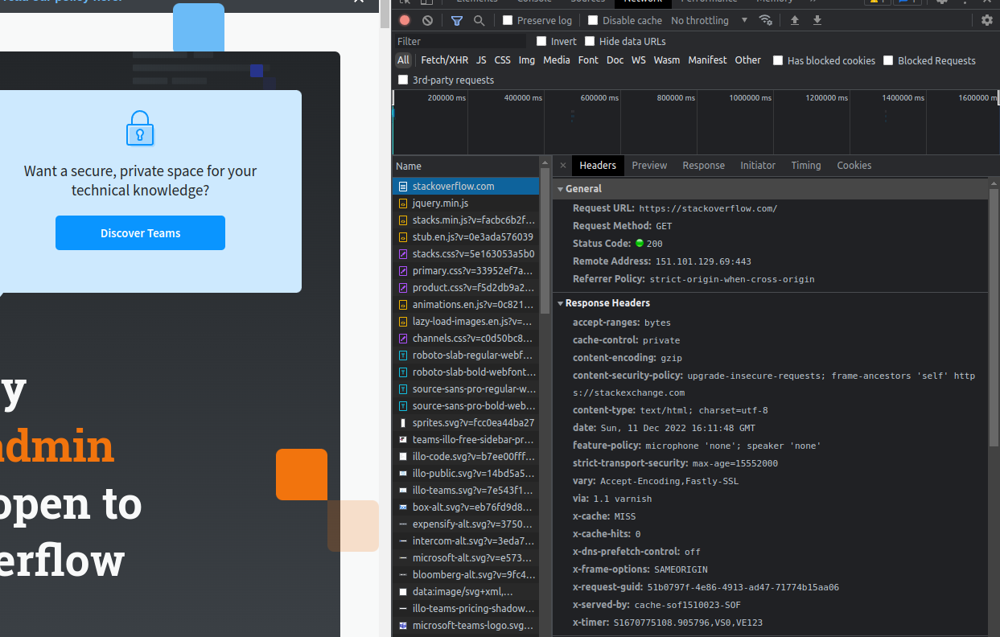
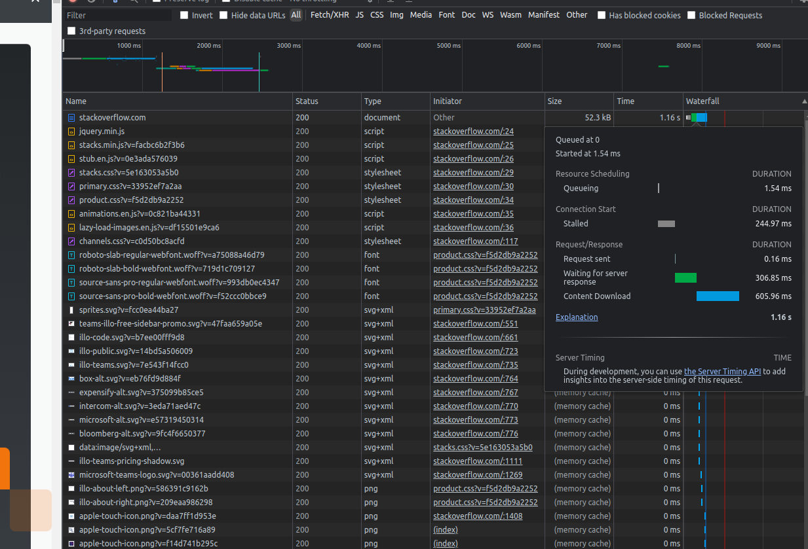

**1. Работа c HTTP через телнет.
Подключитесь утилитой телнет к сайту stackoverflow.com telnet stackoverflow.com 80
Отправьте HTTP запрос**

```
GET /questions HTTP/1.0
HOST: stackoverflow.com
```

**В ответе укажите полученный HTTP код, что он означает?** 


Код ответа - 403 Forbidden. Запрос был принят и опознан, но сервер отказывается его выполнять. 

Stackoverflow указал причиной - this IP address has been blocked from access to our services. If you believe this to be in error, 
please contact us at team@stackexchange.com.

**2. Повторите задание 1 в браузере, используя консоль разработчика F12.**

```
откройте вкладку Network
отправьте запрос http://stackoverflow.com
найдите первый ответ HTTP сервера, откройте вкладку Headers
укажите в ответе полученный HTTP код
проверьте время загрузки страницы, какой запрос обрабатывался дольше всего?
приложите скриншот консоли браузера в ответ.
```




Код ответа - 200 Forbidden. 



GET https://stackoverflow.com обрабатывался больше всего - всего 1.16 секунд.  

**3. Какой IP адрес у вас в интернете?**

```bash
margo@margo-HP-Laptop-15s-eq0xxx:~$ wget -qO- eth0.me
188.169.###.##
```

**4. Какому провайдеру принадлежит ваш IP адрес? Какой автономной системе AS? Воспользуйтесь утилитой whois**

```bash
margo@margo-HP-Laptop-15s-eq0xxx:~$ whois 188.169.###.##| grep descr
descr:          SILKNET BROADBAND
descr:          UTG MPLS DSL
```

```bash
margo@margo-HP-Laptop-15s-eq0xxx:~$ whois 188.169.###.##| grep origin
origin:         AS35805
```

**5. Через какие сети проходит пакет, отправленный с вашего компьютера на адрес 8.8.8.8? Через какие AS? Воспользуйтесь утилитой traceroute**

```bash
margo@margo-HP-Laptop-15s-eq0xxx:~$ traceroute -An 8.8.8.8
traceroute to 8.8.8.8 (8.8.8.8), 30 hops max, 60 byte packets
 1  192.168.100.1 [*]  96.976 ms  123.894 ms  131.727 ms
 2  31.146.255.245 [AS35805]  489.731 ms  500.238 ms  500.347 ms
 3  188.123.128.0 [AS35805]  500.465 ms  500.580 ms  500.712 ms
 4  188.123.128.15 [AS35805]  500.832 ms  500.945 ms 188.123.128.1 [AS35805]  501.062 ms
 5  72.14.242.73 [AS15169]  501.143 ms 72.14.242.72 [AS15169]  580.420 ms 72.14.242.73 [AS15169]  520.565 ms
 6  72.14.242.72 [AS15169]  580.503 ms  511.565 ms 108.170.252.65 [AS15169]  90.931 ms
 7  172.253.50.151 [AS15169]  92.149 ms 172.253.71.107 [AS15169]  92.256 ms 108.170.251.129 [AS15169]  96.036 ms
 8  142.251.64.187 [AS15169]  86.789 ms 8.8.8.8 [AS15169]  99.828 ms  102.607 ms

```

AS - AS35805, AS15169

**6.Повторите задание 5 в утилите mtr. На каком участке наибольшая задержка - delay?**

```bash
margo@margo-HP-Laptop-15s-eq0xxx:~$ mtr 8.8.8.8 -znrc 1
Start: 2022-12-11T20:55:38+0400
HOST: margo-HP-Laptop-15s-eq0xxx  Loss%   Snt   Last   Avg  Best  Wrst StDev
  1. AS???    192.168.100.1        0.0%     1  107.8 107.8 107.8 107.8   0.0
  2. AS35805  31.146.255.245       0.0%     1   11.7  11.7  11.7  11.7   0.0
  3. AS35805  188.123.128.0        0.0%     1   15.7  15.7  15.7  15.7   0.0
  4. AS35805  188.123.128.1        0.0%     1   15.9  15.9  15.9  15.9   0.0
  5. AS15169  72.14.242.73         0.0%     1   14.6  14.6  14.6  14.6   0.0
  6. AS15169  72.14.242.72         0.0%     1  106.9 106.9 106.9 106.9   0.0
  7. AS15169  108.170.252.1        0.0%     1  109.6 109.6 109.6 109.6   0.0
  8. AS15169  142.251.64.187       0.0%     1  106.6 106.6 106.6 106.6   0.0
  9. AS15169  8.8.8.8              0.0%     1  110.2 110.2 110.2 110.2   0.0
```

Самая большая задержка на 9 участке

**7.Какие DNS сервера отвечают за доменное имя dns.google? Какие A записи? Воспользуйтесь утилитой dig**

```bash
margo@margo-HP-Laptop-15s-eq0xxx:~$ dig  +short NS dns.google
ns1.zdns.google.
ns3.zdns.google.
ns2.zdns.google.
ns4.zdns.google.
margo@margo-HP-Laptop-15s-eq0xxx:~$ dig  +short A dns.google
8.8.8.8
8.8.4.4
```

**8. Проверьте PTR записи для IP адресов из задания 7. Какое доменное имя привязано к IP? Воспользуйтесь утилитой dig**

```bash
margo@margo-HP-Laptop-15s-eq0xxx:~$ dig -x 8.8.4.4 | grep PTR
;4.4.8.8.in-addr.arpa.		IN	PTR
4.4.8.8.in-addr.arpa.	7	IN	PTR	dns.google.
margo@margo-HP-Laptop-15s-eq0xxx:~$ dig -x 8.8.8.8 | grep PTR
;8.8.8.8.in-addr.arpa.		IN	PTR
8.8.8.8.in-addr.arpa.	3488	IN	PTR	dns.google.
```

К IP привязано доменное имя dns.google