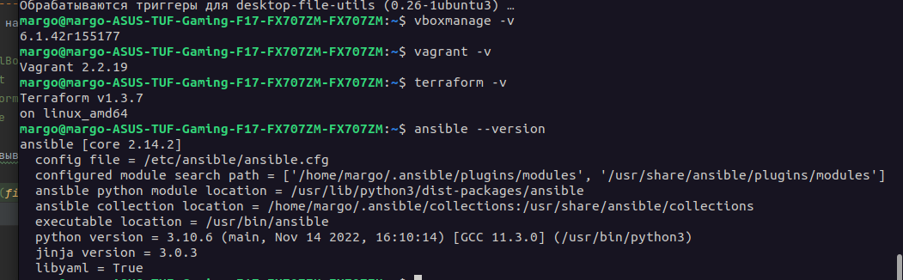
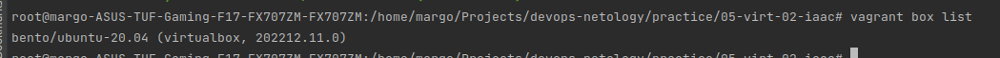
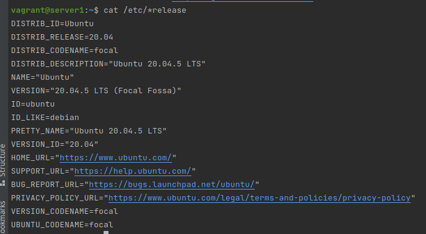
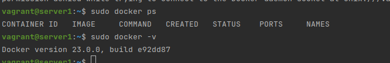

---------------------------------
Задача 1
---------------------------------

    Опишите своими словами основные преимущества применения на практике IaaC паттернов.
    Какой из принципов IaaC является основополагающим?

Большим плюсом IaaC подхода закючается в том, что благодаря ему можно избежать проблемы 
превращения серверов в сервера-снежинки, что упрощает работу с ними.
Вторым, но не менее важным плюсом я бы назвала возможность автоматизировать 
разворачивания окружений.

IaaC означает подход, который заключатес в том, что мы работаем с 
Инфраструктурой как кодом. Такой подход позволяет  создавать идемпотентную инфраструктуру.


---------------------------------
Задача 2
---------------------------------
    Чем Ansible выгодно отличается от других систем управление конфигурациями?
    Какой, на ваш взгляд, метод работы систем конфигурации более надёжный push или pull?

1. Простота (использование протокола ssh, не требуется установки специальных агентов на целевых хостах)
2. Скорость
3. Расширяемость

Более надежным будет push, поскольку позволяет работать с последней версией и не породит конфликтов

---------------------------------
Задача 3
---------------------------------
Установить на личный компьютер:

    VirtualBox
    Vagrant
    Terraform
    Ansible

Приложить вывод команд установленных версий каждой из программ, оформленный в markdown.



```bash
margo@margo-ASUS-TUF-Gaming-F17-FX707ZM-FX707ZM:~$ vboxmanage -v
7.0.6r155176
margo@margo-ASUS-TUF-Gaming-F17-FX707ZM-FX707ZM:~$ vagrant -v
Vagrant 2.2.19
margo@margo-ASUS-TUF-Gaming-F17-FX707ZM-FX707ZM:~$ terraform -v
Terraform v1.3.7
on linux_amd64
margo@margo-ASUS-TUF-Gaming-F17-FX707ZM-FX707ZM:~$ ansible --version
ansible [core 2.14.2]
  config file = /etc/ansible/ansible.cfg
  configured module search path = ['/home/margo/.ansible/plugins/modules', '/usr/share/ansible/plugins/modules']
  ansible python module location = /usr/lib/python3/dist-packages/ansible
  ansible collection location = /home/margo/.ansible/collections:/usr/share/ansible/collections
  executable location = /usr/bin/ansible
  python version = 3.10.6 (main, Nov 14 2022, 16:10:14) [GCC 11.3.0] (/usr/bin/python3)
  jinja version = 3.0.3
  libyaml = True

```

---------------------------------
Задача 4
---------------------------------

Воспроизвести практическую часть лекции самостоятельно.

    Создать виртуальную машину.
    Зайти внутрь ВМ, убедиться, что Docker установлен 

Используемые команды:

```bash
export VAGRANT_DEFAULT_PROVIDER=virtualbox
```

```bash
vagrant box add bento/ubuntu-20.04 --provider=virtualbox --force
```

```bash
vagrant box list
```



```bash
vagrant up
```

```bash
vagrant ssh
cat /etc/*release
```

Настройка из файлов practice/05-virt-02-iaac/step-1 (без ansible)




Настройка из файлов practice/05-virt-02-iaac/step-2 (c ansible и docker).

```bash
vagrant ssh
sudo docker ps
sudo docker -v
```



P.S. Пришлось доработать исходный код, в hosts не были указаны (erver1.netology ansible_host=127.0.01 ansible_port=20011 ansible_user=vagrant)
Возможно ошибка - https://github.com/netology-code/virt-video-code/blob/main/ansible/inventory/hosts
